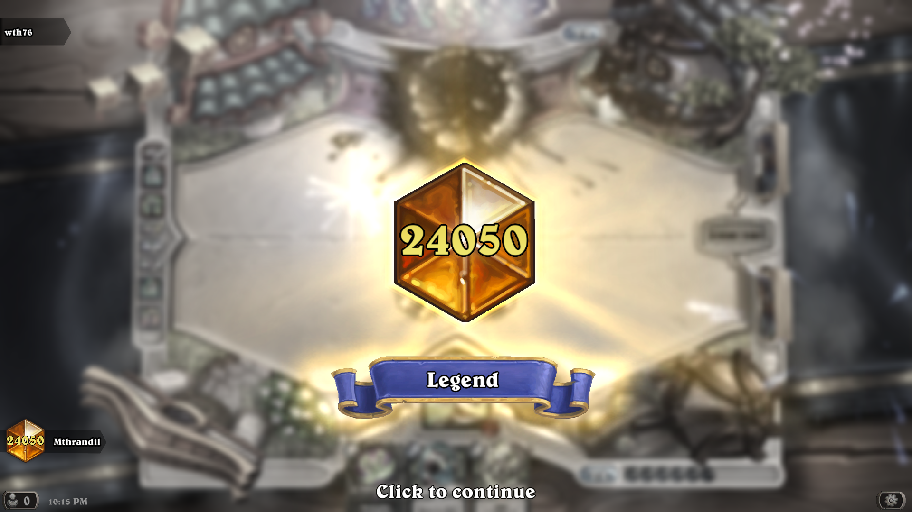
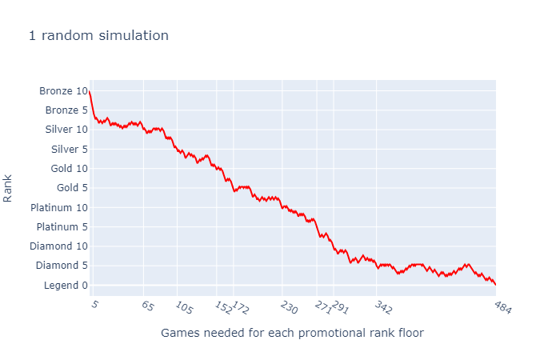
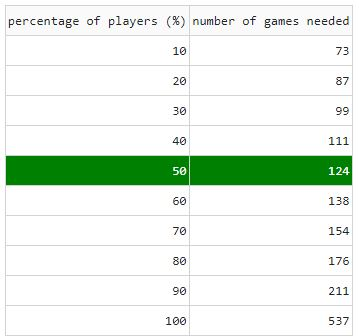

# How many games does it takes to get to legend in Hearthstone?

Apparently if you Google this question, you will get to [Primedope's website](https://www.primedope.com/number-of-games-to-reach-legend-in-hearthstone/). However, the simulator is buggy and won't let me calculate the average number of games from Diamond 5 onwards, so I wrote my own.

I also added a simple random walk graph to show the progress from Bronze 10 to Legend and it confirms my suspicions that D5 to Legend is so much harder compared to the other ranks. 

I reached Legend in 148 games which I tracked from Diamond 10 onwards. A below average record according to my simulator. Ouch

# Instructions
1. pip install -r requirements.txt
2. python main.py